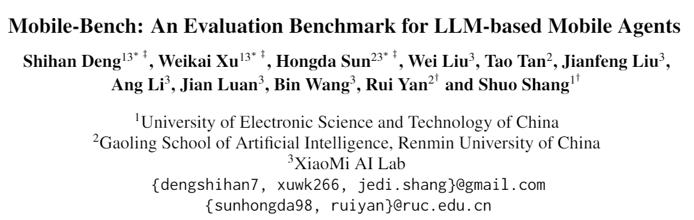
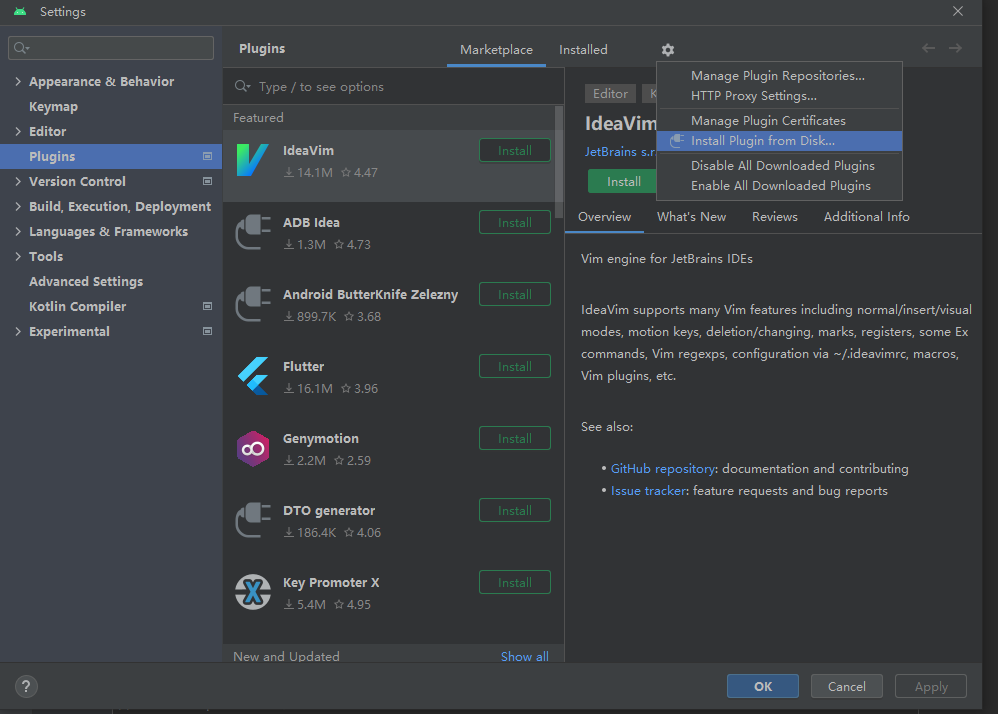
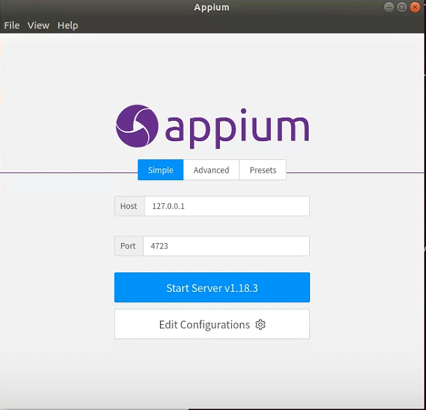
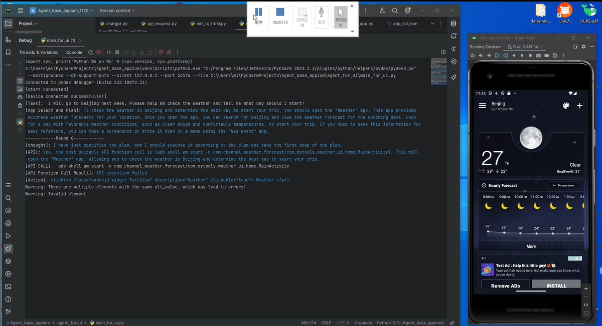

# Mobile Bench Environment Setup Guide

## Paper link: 
[Mobile-Bench: An Evaluation Benchmark for LLM-based Mobile Agents](https://aclanthology.org/2024.acl-long.478/)

### 1. Required Software Versions

- **OS**: Ubuntu 18.04 
- **Python**: Python 3.9.11 [Python-3.9.11.tgz]
- **Android Studio**: Android Studio 2022.3.1.21 [android-studio-2022.3.1.21-linux.tar.gz]
- **Appium**: Appium 1.18.3 [Appium-linux-1.18.3.AppImage]
- **MIUI Emulator**: miui 1.0.1 [MIUIAndroidEmulator-1.0.1.zip]

**Note**: Ensure the Android, Appium, and MIUI versions are strictly aligned; otherwise, the environment may not start properly.

---

### 2. Android Studio Installation

- Download the Android Studio package: `android-studio-2022.3.1.21-linux.tar.gz`

1. Extract the package:  
   `tar -xvf android-studio-2022.3.1.21-linux.tar.gz`
2. Navigate to the bin folder:  
   `cd android-studio/bin`
3. Run the installer:  
   `./studio.sh`
4. Select "standard" and SDK version 34, no need to install the emulator.
5. Open Android Studio and verify that the SDK directory is properly configured:  
   Go to **Tools -> SDK Manager**.

---


### 3. Java Environment Setup

- **JAVA_HOME**: The JDK installation path is typically located in `/usr/lib/jvm/`.
- **ANDROID_HOME**: The Android SDK path is typically in `/home/<username>/Android/Sdk`. Verify the location through **Android Studio -> Tools -> SDK Manager**.

#### Configuration steps:
1. Open the bashrc file:  
   `sudo gedit ~/.bashrc`
2. Add the following environment variables (modify according to your actual paths):

    ```bash
    export JAVA_HOME=/usr/lib/jvm/java-11-openjdk-amd64
    export JRE_HOME=${JAVA_HOME}/jre
    export CLASSPATH=.:${JAVA_HOME}/lib:${JRE_HOME}/lib
    export ANDROID_HOME=/home/<username>/Android/Sdk
    export PATH=$ANDROID_HOME/bin:$PATH:$ANDROID_HOME/tools:$ANDROID_HOME/platform-tools
    ```

3. Save and close the file, then reload bashrc:  
   `source ~/.bashrc`
4. Verify the Java environment:  
   `echo $JAVA_HOME`

**Appium Configuration**: Appium may not have sufficient permissions after setup, so configure it accordingly:
1. Open **Edit Configuration**
2. Import environment variables.

---


### 4. MIUI Installation (Real devices are recommended for better performance)

1. Download MIUI 1.0.1.
2. Open Android Studio: **Files -> Settings -> Plugins -> Settings (top right corner) -> INSTALL PLUGIN FROM DISK**. Select the downloaded MIUI package and wait for the emulator to install.
3. The first-time setup of the emulator takes around 10 minutes. Emulator files are stored in `/usr/.miui`. To reset the configuration, delete this folder.
4. Enable developer mode on your phone:  
   Go to **Settings -> My Device -> Tap System Version multiple times**.
5. Enable USB debugging:  
   Go to **More Settings -> Developer Options** and enable both **USB Debugging** and **Install via USB**.
6. Connect the device to Appium: Ensure that the device's name is recognized properly, and remove any unnecessary prefixes.
7. Create a backup snapshot to prevent crashes: Backup files are stored in `/usr/.miui/avd/snapshots`.
8. Start the MIUI emulator using the following command:

    ```bash
    /home/<username>/.miui/emulator/emulator -avd miui_emulator_phone_34 -sysdir /home/<username>/.miui/system-images/android-34/miui_emulator_phone_34/xiaomix86_64
    ```

9. For real devices: Connect the device via USB and enable USB debugging on the phone.

---

### 5. ADB Installation

ADB is installed with the SDK, but the version might not match. Use ADB version 41.

1. Download **ADB version 41**: `platform-tools_r34.0.5-linux.zip`
2. Extract and replace the original ADB executable. Be sure to back up the original.
3. Check the version by running:  
   `adb --version`
4. When the emulator is running, check if the device is connected:  
   `adb devices` (should show `emulator-5554`).

---

### 6. Python Environment Setup

- Install required packages:  
   `pip install Appium-Python-Client -i https://pypi.tuna.tsinghua.edu.cn/simple`
  
   If `open_driver(desired_caps)` throws an error, downgrade **Appium-Python-Client** to version 1.3.0.

#### Required packages (`requirements.txt`):

```text
aligo==6.1.14
annotated-types==0.6.0
anyio==4.2.0
anytree==2.12.1
Appium-Python-Client==1.3.0
attrs==23.2.0
backoff==2.2.1
certifi==2024.2.2
cffi==1.16.0
charset-normalizer==3.3.2
coloredlogs==15.0.1
cryptography==42.0.2
datclass==0.2.27
distro==1.9.0
exceptiongroup==1.2.0
h11==0.14.0
httpcore==1.0.2
httpx==0.26.0
humanfriendly==10.0
idna==3.6
numpy==1.26.4
openai==1.12.0
outcome==1.3.0.post0
pillow==10.2.0
protobuf==4.25.2
psutil==5.9.8
pycparser==2.21
pydantic==2.6.1
pyOpenSSL==24.0.0
pypng==0.20220715.0
PySocks==1.7.1
qrcode==7.4.2
qrcode-terminal==0.8
requests==2.31.0
selenium==3.141.0
six==1.16.0
sniffio==1.3.0
sortedcontainers==2.4.0
tqdm==4.66.1
trio==0.24.0
trio-websocket==0.11.1
typing_extensions==4.9.0
urllib3==1.26.18
urllib3-secure-extra==0.1.0
wsproto==1.2.0
```

- Install Node.js and Appium:

    ```bash
    curl -fsSL https://deb.nodesource.com/setup_20.x | sudo -E bash -
    sudo apt-get install -y nodejs
    sudo apt install npm
    npm install -g appium@1.18.3
    ```

- Install graphical libraries:  
   `sudo apt-get install xorg`

- Activate the Python virtual environment:  
   `source /path/to/new/virtual/environment/bin/activate`

- Install Appium Python Client 1.3.0:  
   `pip install Appium-Python-Client==1.3.0`

---

### 7. Test Application Configuration

1. **Software Requirements**:
   MobileBench tests need real-world environments. Therefore, ensure that all required apps are pre-installed on the device and that the user is logged in. It is recommended to place the apps directly on the home screen for easier access during testing. Avoid placing apps under folders labeled "Recommended" or "Hot," as this increases the difficulty for the model to locate the app.

2. **Data Preparation**:
   Since the test requires access to system apps, make sure the device has at least 3 contacts, SMS records, diary entries, memo information, and 3 photos.

---

### 8. Baseline Code Explanation

1. The main themes of the code are **agent_for_api** and **agent_for_ui**. The main program is `main_for_ui.py`. APIs are listed in `api_list.json`, and there are two prompt files: `agent_html_prompt.py` and `agent_api_prompt.py`. The `xml_to_html.py` file handles structured text generation.
   
2. Since the testing process requires resetting the environment before each task, there are two solutions:
   - Return to the main screen (effective for single app testing).
   - Clear background processes. However, this might cause socket hang-ups, which is currently unresolved.

3. The test case difficulty may be related to the actual data stored on the phone. If the required information cannot be found on the phone, the task may fail.

4. App versions can influence test results. It is recommended to base baseline experiments on the actual test outcomes.

---


### 9.Demos
For the query: Please book me a flight to Beijing next Friday. You need to pay extra attention to the hotel, weather and itinerary.

[Download video](./多app交互-查看天气.mp4)

### 10.License

Copyright (C) 2024 Xiaomi Corporation.

The code in this project is licensed under the **Apache License, Version 2.0** (the "License"); you may not use this file except in compliance with the License. You may obtain a copy of the License at [http://www.apache.org/licenses/LICENSE-2.0](http://www.apache.org/licenses/LICENSE-2.0).

Unless required by applicable law or agreed to in writing, software distributed under the License is distributed on an "AS IS" BASIS, WITHOUT WARRANTIES OR CONDITIONS OF ANY KIND, either express or implied. See the License for the specific language governing permissions and limitations under the License.

The dataset included in this project is licensed under the **Creative Commons Attribution-NonCommercial-ShareAlike 4.0 International (CC BY-NC-SA 4.0)** license.

And it is copyrighted by [Xiaomi Corporation] and is used under the terms specified by the dataset provider. Please refer to the [dataset license](https://creativecommons.org/licenses/by-nc-sa/4.0/legalcode) for specific usage rights and restrictions.

For any commercial usage or redistribution of the dataset, please contact the copyright holder.

#### Summary of Terms
- **Attribution**: You must give appropriate credit, provide a link to the license, and indicate if changes were made.
- **NonCommercial**: You may not use the material for commercial purposes.
- **ShareAlike**: If you remix, transform, or build upon the material, you must distribute your contributions under the same license as the original.


#### License Badge
[](https://creativecommons.org/licenses/by-nc-sa/4.0/)

### 11.Citation
If you'd like to use our benchmark or cite this paper, please kindly use the reference below:
```
@article{deng2024mobile,
  title={Mobile-bench: An evaluation benchmark for llm-based mobile agents},
  author={Deng, Shihan and Xu, Weikai and Sun, Hongda and Liu, Wei and Tan, Tao and Liu, Jianfeng and Li, Ang and Luan, Jian and Wang, Bin and Yan, Rui and others},
  journal={arXiv preprint arXiv:2407.00993},
  year={2024}
}
```
If you have any questions, please contact xuwk266@gmail.com
